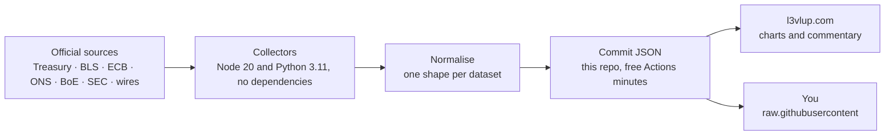

<div align="center">

# L3VLUP Open Data & Skills

**Open finance data and free career skills from [L3VLUP](https://www.l3vlup.com), the career platform for finance and tech.**

[](https://github.com/Surojitc/l3vlup-skills/actions/workflows/collect.yml)
[](LICENSE)
[](#sources-and-method)
[](#using-the-data)

</div>

---

## What this is

Five datasets, collected on their own schedule from the agencies and wires that
publish them, normalised into plain JSON and committed here. No API key, no
signup, no rate limit, no account. If it is useful to you, take it.

| Dataset | Contents | Updated |
|---|---|---|
| [`data/macro.auto.json`](data/macro.auto.json) | 11 series: US Treasury 10Y and 2Y, the 2s10s curve, CPI and unemployment; Eurozone HICP, ECB deposit rate and 10Y AAA yield; UK CPI, Bank Rate and 10Y gilt | Weekly |
| [`data/calendar.auto.json`](data/calendar.auto.json) | Upcoming economic releases and central-bank rate decisions for the US, Eurozone and UK, with times and market-mover flags | Daily |
| [`data/deals.auto.json`](data/deals.auto.json) | Announced M&A and private-equity deals, with transaction values where the release discloses one | Daily |
| [`data/decks.auto.json`](data/decks.auto.json) | Every Schedule 13E-3 take-private since 2020: target, sector, buyer, adviser, stated transaction value, and a link to each banker board presentation filed as an exhibit on sec.gov | Weekly |
| [`data/precedent-transactions.auto.json`](data/precedent-transactions.auto.json) | Take-privates and public-target mergers read out of the filings themselves: the offer per share, the premiums the filing states, the target's last twelve months of revenue, EBITDA and net debt at announcement, and the multiples those imply | Monthly |

Rendered with charts, commentary and an interactive yield-curve model:
**[Macro Chartbook](https://www.l3vlup.com/macro)** ·
**[Economic Calendar](https://www.l3vlup.com/macro/calendar)** ·
**[Curve Lab](https://www.l3vlup.com/macro/curve-lab)** ·
**[Deal Pulse](https://www.l3vlup.com/pulse)** ·
**[Banker board books](https://www.l3vlup.com/intel/deal-decks)**

---

## Using the data

Fetch it directly. These URLs are stable.

```bash
curl https://raw.githubusercontent.com/Surojitc/l3vlup-skills/main/data/macro.auto.json
```

```js
const res = await fetch(
  'https://raw.githubusercontent.com/Surojitc/l3vlup-skills/main/data/macro.auto.json'
);
const { series } = await res.json();

const tenYear = series.find((s) => s.id === 'us-treasury-10y');
const latest = tenYear.points.at(-1);
console.log(`US 10Y: ${latest.v}% as of ${latest.d}`);
```

```python
import requests

url = "https://raw.githubusercontent.com/Surojitc/l3vlup-skills/main/data/macro.auto.json"
series = {s["id"]: s for s in requests.get(url).json()["series"]}

curve = series["us-curve-2s10s"]["points"][-1]
print(f"2s10s: {curve['v']}bp on {curve['d']}")
```

### Shapes

Every file carries a `generatedAt` ISO timestamp at the top level.

<details>
<summary><code>macro.auto.json</code></summary>

```jsonc
{
  "generatedAt": "2026-08-24T10:06:12.418Z",
  "series": [
    {
      "id": "us-treasury-10y",
      "country": "US",                  // US | Eurozone | UK
      "name": "10-Year Treasury Yield",
      "unit": "%",                      // % | bp
      "sourceName": "U.S. Department of the Treasury",
      "url": "https://home.treasury.gov/...",
      "blurb": "The risk-free rate every DCF on earth is quietly built on.",
      "points": [{ "d": "2026-08-21", "v": 4.74 }]   // monthly, oldest first
    }
  ]
}
```
</details>

<details>
<summary><code>calendar.auto.json</code></summary>

```jsonc
{
  "generatedAt": "2026-08-24T10:02:41.882Z",
  "events": [
    {
      "date": "2026-09-11",             // YYYY-MM-DD
      "time": "08:30",                  // local to the agency, null when unpublished
      "tz": "ET",                       // ET | CET | GMT
      "country": "US",
      "title": "Consumer Price Index",
      "source": "Bureau of Labor Statistics",
      "url": "https://www.bls.gov/schedule/news_release/",
      "importance": "high"              // high = moves markets, medium = context
    }
  ]
}
```
</details>

<details>
<summary><code>deals.auto.json</code></summary>

```jsonc
{
  "generatedAt": "2026-08-24T10:02:47.201Z",
  "items": [
    {
      "title": "Kimbell Royalty Partners Closes $221.2 Million Drop Down Acquisition",
      "link": "https://www.prnewswire.com/news-releases/...",
      "source": "PR Newswire",
      "date": "2026-08-21T21:30:00.000Z",
      "dealValue": "$221M"              // null when the release discloses none
    }
  ]
}
```
</details>
<details>
<summary><code>decks.auto.json</code></summary>

```jsonc
{
  "generatedAt": "2026-09-06T21:35:00.000Z",
  "since": 2020,
  "indexedThrough": "2026Q3",
  "counts": { "transactions": 277, "withDecks": 182, "decks": 1186, "valued": 228, "filings": 1280 },
  "transactions": [
    {
      "id": "0001193125-20-245290",        // accession of the initial schedule
      "announced": "2020-09-14",
      "year": 2020,
      "quarter": "2020Q3",
      "target": { "name": "AKCEA THERAPEUTICS, INC.", "cik": "0001662524", "sic": "2834", "sicDescription": "PHARMACEUTICAL PREPARATIONS", "state": "DE" },
      "sector": "Healthcare",             // from the SEC industry code
      "buyers": ["IONIS PHARMACEUTICALS INC", "AVALANCHE MERGER SUB, INC."],
      "buyerType": "Strategic",           // heuristic on the filing persons' names
      "advisers": ["Goldman Sachs", "Stifel"],
      "transactionValue": 536,            // USD millions, as stated in the filing-fee table
      "valueSource": "cover page",        // or "EX-FILING FEES"
      "capSize": "Small",                 // Micro < $250m · Small · Mid · Large · Mega > $20bn · Undisclosed
      "analyses": ["dcf", "precedents", "trading-comps"],   // detected in the readable exhibits
      "rating": "A",                      // A–D teaching-value grade, null when no deck was filed
      "filings": [{ "form": "SC 13E3", "filed": "2020-09-14", "accession": "…", "filingUrl": "https://www.sec.gov/…" }],
      "decks": [{ "id": "…", "exhibit": "EX-99.CII", "url": "https://www.sec.gov/…", "bytes": 27934, "isPdf": false, "advisers": ["Goldman Sachs"], "analyses": ["…"], "filed": "2020-09-14" }],
      "hasDecks": true
    }
  ],
  "filings": [ /* one row per filing, the raw material the transactions are built from */ ]
}
```
</details>
<details>
<summary><code>precedent-transactions.auto.json</code></summary>

```jsonc
{
  "generatedAt": "2026-09-08T08:57:48Z",
  "method": { /* one sentence per field saying where it was read from */ },
  "counts": { "transactions": 4292, "withOffer": 3192, "withMultiples": 1384, "withPremium": 1741, "flagged": 1469, "takePrivates": 792, "publicMergers": 3500 },
  "transactions": [
    {
      "id": "0001140361-26-030551",       // accession of the filing it was read from
      "source": "DEFM14A",                // DEFM14A · DEFM14C · SC 13E3
      "dealType": "public merger",        // or "take-private"
      "target": { "name": "Arcosa, Inc.", "cik": "0001739445", "sic": "3440", "sicDescription": "Fabricated Structural Metal Products", "state": "DE" },
      "sector": "Industrials",
      "acquirer": "CRH Americas, Inc.",
      "announced": "2026-06-21",          // the merger agreement date
      "announcedBasis": "merger agreement",  // or "filing date", where none is stated
      "offerPrice": 150.0,                // per-share cash consideration, as stated
      "consideration": "cash",
      "premium1Day": 0.104,               // the premiums the filing states, as fractions
      "premium52WeekHigh": 0.01,
      "unaffectedPrice": 135.87,          // offerPrice / (1 + premium1Day)
      "sharesOut": 49.096,                // millions, cover-page count at announcement
      "ltmRevenue": 2823.1,               // USD millions, to the last period end before the deal
      "ltmEbitda": 556.1,
      "netDebt": 1367.9,
      "equityValue": 7364.4,              // offerPrice x sharesOut
      "ev": 8732.3,                       // equityValue + netDebt
      "evLtmRev": 3.09,
      "evLtmEbitda": 15.7,
      "status": "ok",                     // or no-offer · no-consideration · rejected · error
      "flags": [],
      "documentsRead": ["https://www.sec.gov/…"]
    }
  ]
}
```

A flagged row failed a cross-check and is kept rather than dropped, so you can see
what the filing said and decide for yourself. `doubt` says which of its figures the
flag puts in question, the multiples or the premiums.
</details>

---

## Sources and method

Everything here comes from the organisation that publishes the number. There is no
aggregator, no reseller, and no scraped paywall anywhere in the chain.

| Dataset | Sources |
|---|---|
| Macro | [US Treasury](https://home.treasury.gov/resource-center/data-chart-center/interest-rates) daily yield curve · [BLS](https://www.bls.gov/) CPI and unemployment · [ECB Data Portal](https://data.ecb.europa.eu/) · [ONS](https://www.ons.gov.uk/) · [Bank of England](https://www.bankofengland.co.uk/boeapps/database/) |
| Calendar | BLS release schedule (ICS) · [BEA](https://www.bea.gov/news/schedule) · [Federal Reserve FOMC calendar](https://www.federalreserve.gov/monetarypolicy/fomccalendars.htm) · ECB Governing Council dates · ONS release calendar · Bank of England MPC dates |
| Deals | PR Newswire and GlobeNewswire M&A wires |
| Board books | [SEC EDGAR](https://www.sec.gov/) quarterly form index, submission headers, filing-fee tables and the adviser exhibits themselves, read once each |
| Precedent transactions | [SEC EDGAR](https://www.sec.gov/) Schedule 13E-3 transaction statements, DEFM14A and DEFM14C merger proxies, and the targets' own XBRL company facts |



**Principles the collectors follow.** Every record keeps the source name and a link to
the original release, so any figure can be traced back in one click. Deal headlines link
their press release; this repo collects and normalises, it does not republish anyone's
journalism. Nothing is inferred or filled in: a gap in the source is a gap here, because
a value that looks real but was invented is worse than a missing one. Series merge
point-by-point across runs, so history accumulates and a failing source leaves the
previous data intact rather than blanking a chart.

---

## Running the collectors

Node 20 and Python 3.11, zero dependencies, no credentials.

```bash
npm run macro       # FULL_HISTORY=1 npm run macro  rebuilds 26 years of Treasury data
npm run calendar
npm run deals
npm run sync:decks
npm run precedents  # take-privates listed in the board-book index
npm run mergers     # public mergers, and take-privates filed before 2020
```

[`.github/workflows/collect.yml`](.github/workflows/collect.yml) runs the calendar and
deal tape daily at 06:00 UTC, adds the macro chartbook and the board books on Mondays,
adds the precedent transactions on the first of each month, and commits whatever
changed. Each step is independent, so one failing source never stops the others.

The monthly cadence is the pace of the data. A merger proxy is a quarterly-ish event,
so looking for new ones every morning would spend thousands of SEC requests to find
nothing. The collector is incremental either way: a deal already on file is never read
again.

---

## Free skills

The free tier of the L3VLUP skills library: the workflows early-career finance
professionals are actually handed, each producing a real deliverable rather than a
description of one. Browse the full library at
**[l3vlup.com/skills](https://www.l3vlup.com/skills)**.

| Skill | Output | Run it |
|---|---|---|
| [Company Profile](skills/company-profile/) | Banker one-pager: five years of income statement, balance sheet and cash flow, margins as live formulas, every figure sourced | `python3 skills/company-profile/build.py AAPL` |
| [Comps Set Builder](skills/comps-set-builder/) | Trading comparables with live multiple formulas, set statistics and a prompted inclusion-and-rejection rationale | `python3 skills/comps-set-builder/build.py NVDA --peers AMD,AVGO` |

```bash
pip install openpyxl
python3 skills/company-profile/build.py AAPL --years 5 --out out/
```

Built workbooks land in [`samples/`](samples/), rebuilt weekly from live filings.

### The two rules these outputs obey

**Historic financials come from filings.** Every number traces to a filer's own XBRL
tag, carrying the period, the form, the filing date and the accession number, resolved
on a Sources tab at the back of every workbook. Not a screener, not an aggregator, not
a model's recollection. If the filer did not tag a line, the workbook prints an em dash
and says so — blank means "not tagged", never zero.

**Format is meaning.** Blue is an input or a pulled value, black is a formula computed
in the workbook, green is a cross-sheet link, a red cell is a tie-out that failed.
Gridlines off, freeze panes at D7, landscape fit-to-width, negatives in parentheses.
A reader who has never seen the file can tell an assumption from a calculation in two
seconds, which is the only reason conventions exist.

Both rules, and the reasoning behind them, are written down in
**[docs/output-standard.md](docs/output-standard.md)**.

### How the output gets checked

**[docs/review-protocol.md](docs/review-protocol.md)** adapts the audit protocol
from [wildcat-finance/skills](https://github.com/wildcat-finance/skills/tree/main/plugins/hexaemeron)
to financial analysis. The idea it borrows is that reasoning has to leave a trace,
because otherwise "I checked it" and "it looked fine" are indistinguishable: three
tools with trigger conditions, a hard split between a FINDING (carries a figure and
its source) and a LEAD (does not), and an explicit list of what does not count as a
finding at all.

Each skill also keeps an `EVOLUTION.md` ledger recording what changed and *why*,
including the option that was rejected — see
**[docs/skill-evolution.md](docs/skill-evolution.md)**.

## Contributing

Corrections are welcome, particularly a source URL that has moved or a parse that has
drifted. Open an issue with the dataset and what looks wrong. Additional countries and
series are on the roadmap; a pull request that adds one should use the same rule as
everything else here, which is an official primary source or nothing.

## Licence

Code is [MIT](LICENSE). The data files redistribute public-domain source data as-is;
the statistical agencies that publish it set the binding terms. Attribution is
appreciated, never required.
