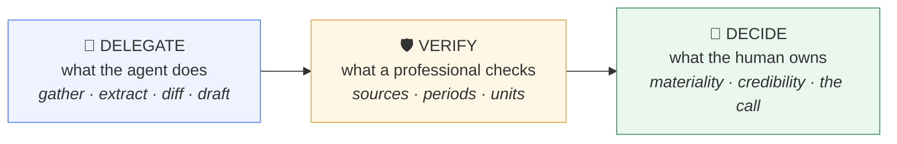

# L3VLUP Finance Skills

**Institutional-grade finance workflows, packaged as open-standard agent skills.**

Earnings teardowns · forensic filing diffs · model audits · LBO sanity checks · IC memos — the way the desk actually does them, with every number source-cited and every judgment left where it belongs.

---

Every skill splits the work three ways — the operating principle of working with AI in finance:

Agent output is never presumed correct. Every number carries a source and a period, or it isn't a number.

## The library

### Investment Banking → [`investment-banking/`](./investment-banking)

The deliverables chain a banking analyst lives in — profiles, comps, books, models.

- **[Company Profile](./investment-banking/company-profile/SKILL.md)** — Build a banker-grade one-pager on any company, fast.
- **[Comps Set Builder](./investment-banking/comps-set-builder/SKILL.md)** — Choose a defensible comparable-companies universe, and be able to defend every inclusion.
- **[Model Audit](./investment-banking/model-audit/SKILL.md)** — Find the errors in a financial model before someone senior does.
- **[Meeting Prep](./investment-banking/meeting-prep/SKILL.md)** — Walk into any client, management or interview meeting knowing the company, the people and the agenda cold.
- **[Pitchbook QC](./investment-banking/pitchbook-qc/SKILL.md)** — Catch the errors in a pitchbook before it leaves the building.

### Private Equity → [`private-equity/`](./private-equity)

Screen to IC — pressure-test the LBO, run the diligence, write the memo.

- **[LBO Sanity Check](./private-equity/lbo-sanity-check/SKILL.md)** — Review an LBO’s returns drivers and catch the assumptions doing the heavy lifting.
- **[IC Memo Builder](./private-equity/ic-memo-builder/SKILL.md)** — Draft a first-pass investment committee memo that anticipates the committee’s questions.
- **[Diligence Question Builder](./private-equity/diligence-question-builder/SKILL.md)** — Build a prioritised diligence list that attacks the thesis, not a generic checklist.

### Equity Research & Hedge Funds → [`equity-research-hedge-funds/`](./equity-research-hedge-funds)

The public-markets research loop — earnings, filings, pitches, catalysts.

- **[Earnings Teardown](./equity-research-hedge-funds/earnings-teardown/SKILL.md)** — Understand what actually changed this quarter — before the market finishes deciding.
- **[Filing Diff](./equity-research-hedge-funds/filing-diff/SKILL.md)** — Find what materially changed between this filing and the last one.
- **[Stock Pitch Builder](./equity-research-hedge-funds/stock-pitch-builder/SKILL.md)** — Turn research into a pitch with a variant perception, not a book report.
- **[Catalyst Monitor](./equity-research-hedge-funds/catalyst-monitor/SKILL.md)** — Track the events that will prove your thesis right or wrong — before they happen.

## Stacks — chained the way the job chains them

- **IB Analyst Stack** — Company Profile → Comps Set Builder → Pitchbook QC → Model Audit → Meeting Prep
- **PE Associate Stack** — Company Profile → LBO Sanity Check → Diligence Question Builder → IC Memo Builder → Model Audit
- **Public Markets Stack** — Earnings Teardown → Filing Diff → Stock Pitch Builder → Catalyst Monitor

## Install

Copy any skill folder into your agent's skills directory (e.g. `.claude/skills/`).
Works with Claude Code and any agent supporting the [Agent Skills open standard](https://github.com/agentskills/agentskills) —
the format indexed by ClawHub, Skills.sh, LobeHub and the wider skill-registry ecosystem.

## Run them interactively

Each skill runs live at [l3vlup.com/skills](https://www.l3vlup.com/skills) — with automatic source fetching
(IR pages, filings, releases — every card cites its URL), practice drills attached, and free runs.

## Provenance & backups

Generated from the canonical library by `scripts/export-skills.mjs` in the L3vlup platform repo:
one source of truth, regenerated on every update, so do not edit these files by hand. Each workflow
folder carries a `workflow.json` in the Finance OS contract
([docs/finance-skill-spec.md](../docs/finance-skill-spec.md)); `index.json` lists them all.
File issues and corrections against the platform repo.

## License

CC-BY-4.0 · © L3VLUP · Built by practitioners (ex-Citigroup, Rothschild, Morgan Stanley, Bank of America; hedge fund CIO).
