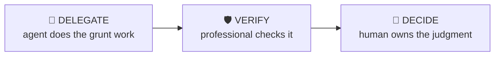

# Catalyst Monitor

> Track the events that will prove your thesis right or wrong — before they happen.

Turn a thesis into a monitoring plan: dated catalysts, the data that leads each one, thresholds that trigger action, and a cadence for re-checking. The difference between having a view and running a position.

| | |
|---|---|
| **Output** | Catalyst calendar + monitoring plan with triggers |
| **Level** | Analyst / Associate · Intermediate |
| **Time** | ~20 min |
| **Context** | On-the-job |

## The operating split

### Delegate — what the agent should do

- Compiling dated events from IR calendars and filings
- Tracking indicator updates on cadence
- Flagging when a monitored metric crosses a threshold

### Verify — agent output a professional must check

- Event dates from primary sources — conference dates move
- Threshold breaches are real, not data glitches

### Decide — judgment the human owns (never the agent)

The agent must NOT make these calls; surface evidence and frame them as open questions:

- The thresholds themselves and the action at each
- Whether a missed catalyst wounds or kills the thesis
- When monitoring says exit, and honouring it

## Inputs

- The thesis and position (or pitch)
- Time horizon
- Kill criteria if already defined

## Workflow

1. **List the catalysts** — Earnings, product events, regulatory dates, competitor prints, macro releases — everything dated that touches the thesis.
2. **Map leading indicators** — What data leaks ahead of each catalyst? Channel checks, web data, peer results, pre-announcements.
3. **Set the triggers** — For each catalyst: what outcome confirms, what kills, and what you’ll DO in each case. Decide now, not in the moment.
4. **Build the calendar** — Dated list with owner, source and check cadence.
5. **Schedule the reviews** — A thesis unreviewed for a quarter is a stale thesis. Fix the cadence.

## Example output

> **Illustrative output** — fictional subject, illustrative content.

A completed run returns **catalyst calendar + monitoring plan with triggers** as structured cards, each carrying a source
reference, followed by a verification block (3 checks: pass / needs-review /
unverified) and the sharpest follow-up questions. The agent covers the Delegate items —
compiling dated events from ir calendars and filings; tracking indicator updates on cadence — and explicitly leaves the Decide
items as open questions for the professional.

## Quality checklist (apply before returning output)

- Every catalyst has date, trigger and pre-decided action
- Kill criteria embedded, not separate
- Next review date exists

## Grounding rules

- Use only source material provided by the user or fetched from pages you cite.
- Every factual claim carries a source reference; numbers carry their period (Q/FY).
- Never invent figures, filings, dates or events; say "not provided" instead.

---

**Run this workflow interactively** — with source auto-fetch and practice drills — at
[l3vlup.com/skills/catalyst-monitor](https://www.l3vlup.com/skills/catalyst-monitor). Next in the chain: **Earnings Teardown**.

The machine-readable form of this workflow, in the Finance OS contract, is
[`workflow.json`](./workflow.json); the contract is described in
[docs/finance-skill-spec.md](../../../docs/finance-skill-spec.md).
