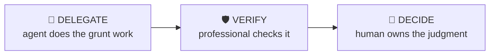

# Earnings Teardown

> Understand what actually changed this quarter — before the market finishes deciding.

A structured pass through a company’s latest results: what moved vs last quarter and vs expectations, what management changed in guidance and language, and which changes matter for the thesis. Built for the night-before or morning-after window when time is the constraint.

| | |
|---|---|
| **Output** | One-page earnings delta memo + questions list |
| **Level** | Analyst / Associate · Core |
| **Time** | ~25 min |
| **Context** | Interviews & on the job |

## The operating split

### Delegate — what the agent should do

- Pulling the release, transcript and prior-quarter comparables into one place
- Extracting reported figures and computing QoQ / YoY deltas
- Diffing guidance text against the prior quarter’s wording
- Flagging KPIs that appeared or disappeared from disclosure
- Assembling a source-linked fact table

### Verify — agent output a professional must check

- Every extracted number against the primary source — transcripts get misparsed
- That guidance is compared to prior guidance, not accidentally to consensus
- Currency, share-count and period consistency across the comparison
- That "growth" figures are organic vs reported where the company splits them

### Decide — judgment the human owns (never the agent)

The agent must NOT make these calls; surface evidence and frame them as open questions:

- Which deltas are thesis-relevant vs noise
- Whether management’s explanation for a miss or beat is credible
- Whether the quarter changes your estimate of earnings power or just timing
- What the two or three questions you’d actually press management on are

## Inputs

- Ticker or company name
- Latest earnings release / transcript (link or paste)
- Prior quarter release for comparison (optional but recommended)
- Your perspective: ER, HF, IB coverage or interview prep

## Workflow

1. **Frame the quarter** — State what the market expected going in: consensus revenue/EPS, the 2-3 debated items, and where the stock traded into the print.
2. **Extract the deltas** — Revenue, margins, EPS and segment KPIs vs last quarter and vs the same quarter last year. Flag every metric that changed direction, not just magnitude.
3. **Diff the guidance** — Compare new guidance against prior guidance AND against consensus — they are different comparisons and get confused constantly.
4. **Read the language** — What did management emphasise, stop mentioning, or newly hedge? Language changes often lead numbers by a quarter.
5. **Judge materiality** — For each delta: does it change the earnings power, the multiple, or neither? Kill the noise.
6. **Write the memo** — One page: what changed, why it matters, what you’d ask management, and whether the thesis moved.

## Example output

> **Illustrative output** — fictional company, illustrative numbers.

**MERIDIAN INDUSTRIALS PLC — Q2 FY2026 TEARDOWN** *(Equity Research lens · quick briefing)*

**So what:** The beat is real but lower-quality than the headline — half the revenue upside is a one-off contract settlement, and FY guidance was raised by less than the Q2 beat, implying a softer H2 than consensus has modelled.

| Card | Finding | Source |
|---|---|---|
| Revenue delta | Revenue £412m, +9% YoY (Q2 FY26 vs Q2 FY25); consensus was £398m. £8m of the £14m beat is a one-off settlement disclosed in note 4. | Q2 FY26 release, p.3, note 4 |
| Guidance diff | FY26 revenue guide raised £1,560m → £1,572m (+£12m) vs a £14m Q2 beat — implied H2 lowered ~£2m. Prior guide, not consensus, used as the base. | Q2 FY26 release p.1 vs Q1 FY26 release p.2 |
| Language shift | "Pricing environment remains constructive" (Q1) → "pricing broadly stable" (Q2). Margin commentary hedged for the first time in four quarters. | Q2 transcript §CEO remarks |
| KPI watch | Order book disclosure dropped from the release for the first time since FY23. | Q2 FY26 release (absent); Q1 FY26 p.5 (present) |

**Verification:** period consistency ✓ pass · guidance-vs-guidance ✓ pass · organic vs reported split ⚠ needs-review (release doesn't split the settlement).

**Investigate next:** Why did the order book disclosure disappear? · Is the settlement margin-accretive or neutral? · What does "broadly stable" pricing mean for H2 gross margin?

## Quality checklist (apply before returning output)

- Every number in the memo carries a period label (Q/FY) and a source
- Guidance-vs-guidance and guidance-vs-consensus stated separately
- At least one thing management de-emphasised is noted
- The memo answers "so what" in the first three lines

## Grounding rules

- Use only source material provided by the user or fetched from pages you cite.
- Every factual claim carries a source reference; numbers carry their period (Q/FY).
- Never invent figures, filings, dates or events; say "not provided" instead.

---

**Run this workflow interactively** — with source auto-fetch and practice drills — at
[l3vlup.com/skills/earnings-teardown](https://www.l3vlup.com/skills/earnings-teardown). Next in the chain: **Stock Pitch Builder**.

The machine-readable form of this workflow, in the Finance OS contract, is
[`workflow.json`](./workflow.json); the contract is described in
[docs/finance-skill-spec.md](../../../docs/finance-skill-spec.md).
