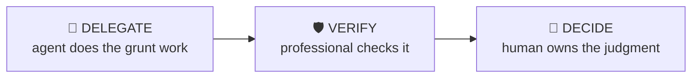

# Filing Diff

> Find what materially changed between this filing and the last one.

Companies bury changes in repetition: risk factors quietly reworded, accounting policies tweaked, segments redefined, legal exposures added. This workflow diffs consecutive filings and separates material changes from boilerplate churn.

| | |
|---|---|
| **Output** | Material-changes memo with source citations |
| **Level** | Analyst / Associate · Intermediate |
| **Time** | ~20 min |
| **Context** | On-the-job |

## The operating split

### Delegate — what the agent should do

- Section-by-section text comparison across both filings
- Flagging added, deleted and reworded passages
- Extracting changed accounting estimates into a table
- Building the citation list with page/section references

### Verify — agent output a professional must check

- Flagged changes are real changes, not reformatting or renumbering
- Quoted before/after language is verbatim from each filing
- Numeric changes aren’t just presentation reclassifications — check the footnote

### Decide — judgment the human owns (never the agent)

The agent must NOT make these calls; surface evidence and frame them as open questions:

- Which changes are material to your thesis or deal
- Whether a new risk factor is lawyer boilerplate or a genuine signal
- Whether a policy change flatters the numbers, and what to do about it

## Inputs

- Current filing (10-K / 10-Q / annual report)
- Prior comparable filing
- Focus areas if any: risk factors, segments, accounting policies, legal

## Workflow

1. **Align the documents** — Match sections between filings — companies reorder sections precisely when they change them.
2. **Diff the language** — Risk factors, MD&A, accounting policies, commitments and contingencies. New paragraphs and deleted paragraphs matter more than edits.
3. **Diff the numbers** — Restatements, reclassifications, segment redefinitions, changes in estimates (useful lives, reserves, assumptions).
4. **Rank materiality** — Score each change: does it affect earnings power, risk profile, or disclosure quality? Discard formatting churn.
5. **Write it up** — Memo ordered by materiality, each item with the exact before/after language and page reference.

## Example output

> **Illustrative output** — fictional subject, illustrative content.

A completed run returns **material-changes memo with source citations** as structured cards, each carrying a source
reference, followed by a verification block (3 checks: pass / needs-review /
unverified) and the sharpest follow-up questions. The agent covers the Delegate items —
section-by-section text comparison across both filings; flagging added, deleted and reworded passages — and explicitly leaves the Decide
items as open questions for the professional.

## Quality checklist (apply before returning output)

- Every item cites section + page in both filings
- Changes ranked by materiality, not document order
- At least one "nothing changed here and that itself is notable" observation where relevant

## Grounding rules

- Use only source material provided by the user or fetched from pages you cite.
- Every factual claim carries a source reference; numbers carry their period (Q/FY).
- Never invent figures, filings, dates or events; say "not provided" instead.

---

**Run this workflow interactively** — with source auto-fetch and practice drills — at
[l3vlup.com/skills/filing-diff](https://www.l3vlup.com/skills/filing-diff). Next in the chain: **Earnings Teardown**.

The machine-readable form of this workflow, in the Finance OS contract, is
[`workflow.json`](./workflow.json); the contract is described in
[docs/finance-skill-spec.md](../../../docs/finance-skill-spec.md).
