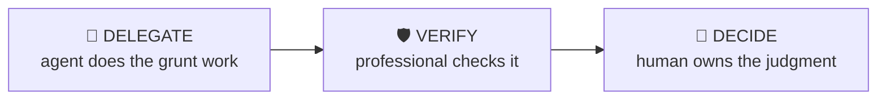

# Stock Pitch Builder

> Turn research into a pitch with a variant perception, not a book report.

Structure a long or short pitch the way buy-side interviewers and PMs actually evaluate them: what the market believes, what you believe differently and why, what it’s worth if you’re right, and what proves you wrong.

| | |
|---|---|
| **Output** | Pitch architecture: thesis, variant view, valuation, catalysts, risks |
| **Level** | Analyst / Associate · Advanced |
| **Time** | ~45 min |
| **Context** | Interviews & on the job |

## The operating split

### Delegate — what the agent should do

- Summarising consensus estimates and sell-side positioning
- Compiling the evidence base with sources
- Building the valuation scenarios from your assumptions
- Drafting the structured pitch from your inputs

### Verify — agent output a professional must check

- Consensus numbers are current, not stale
- Evidence actually supports the variant claim — check each link in the chain
- Valuation math foots; probabilities are yours, not invented

### Decide — judgment the human owns (never the agent)

The agent must NOT make these calls; surface evidence and frame them as open questions:

- The variant perception itself — this is the pitch
- The probabilities on bull/bear/base
- What kill criteria you’ll actually honour

## Inputs

- Ticker and direction (long/short) if decided
- Your research so far — notes, model, or nothing yet
- Format target: 2-minute verbal, 1-pager or full memo

## Workflow

1. **State consensus** — What does the market believe? If you can’t articulate the other side, you don’t have a pitch yet.
2. **Articulate the variant view** — "The market thinks X. I think Y because Z." Z must be evidence, not vibes.
3. **Quantify the skew** — Target price if right, downside if wrong, rough probabilities. A pitch without asymmetry is a coin flip.
4. **Date the catalysts** — What makes the market agree with you, and when? "It’s cheap" is not a catalyst.
5. **Define the kill criteria** — What evidence would make you exit? Deciding this before pitching is what separates process from hope.
6. **Compress to format** — The 2-minute version leads with the variant view and the skew. Cut everything that doesn’t support them.

## Example output

> **Illustrative output** — fictional subject, illustrative content.

A completed run returns **pitch architecture: thesis, variant view, valuation, catalysts, risks** as structured cards, each carrying a source
reference, followed by a verification block (4 checks: pass / needs-review /
unverified) and the sharpest follow-up questions. The agent covers the Delegate items —
summarising consensus estimates and sell-side positioning; compiling the evidence base with sources — and explicitly leaves the Decide
items as open questions for the professional.

## Quality checklist (apply before returning output)

- Variant view stated in one sentence
- Risk/reward quantified with at least 2:1 skew or an explicit reason
- Every catalyst has a date or window
- Kill criteria are specific and observable

## Grounding rules

- Use only source material provided by the user or fetched from pages you cite.
- Every factual claim carries a source reference; numbers carry their period (Q/FY).
- Never invent figures, filings, dates or events; say "not provided" instead.

---

**Run this workflow interactively** — with source auto-fetch and practice drills — at
[l3vlup.com/skills/stock-pitch-builder](https://www.l3vlup.com/skills/stock-pitch-builder). Next in the chain: **Catalyst Monitor**.

The machine-readable form of this workflow, in the Finance OS contract, is
[`workflow.json`](./workflow.json); the contract is described in
[docs/finance-skill-spec.md](../../../docs/finance-skill-spec.md).
