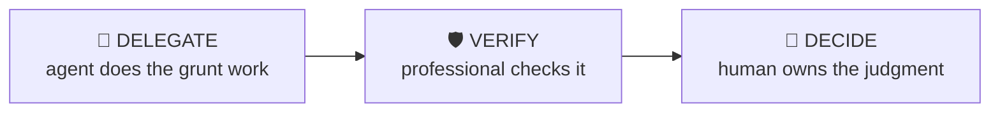

# Comps Set Builder

> Choose a defensible comparable-companies universe, and be able to defend every inclusion.

The comps set decides the valuation before the spreadsheet opens. This workflow builds the candidate universe, applies explicit inclusion/exclusion logic, and documents the rationale so the set survives an MD’s or interviewer’s challenge.

| | |
|---|---|
| **Output** | Comps universe table + inclusion rationale |
| **Level** | Analyst · Core |
| **Time** | ~30 min |
| **Context** | Interviews & on the job |

## The operating split

### Delegate — what the agent should do

- Generating the candidate long list from industry classifications and filings
- Pulling descriptive stats (size, growth, margins) for screening
- Drafting first-pass inclusion/exclusion notes

### Verify — agent output a professional must check

- Candidates actually do what the classification says they do
- No pending-takeover or distressed names polluting trading multiples unflagged
- Financial metrics used for screening are calendarised and like-for-like

### Decide — judgment the human owns (never the agent)

The agent must NOT make these calls; surface evidence and frame them as open questions:

- The comparability criteria themselves — that’s the analytical judgment
- Borderline inclusions: closest-fit-but-different-scale vs same-scale-but-different-model
- Whether to segment the set (e.g. high-growth vs mature) rather than force one universe

## Inputs

- Target company
- Purpose: valuation, pitch, fairness context or interview answer
- Any house view on must-include / must-exclude names

## Workflow

1. **Define comparability** — Business model, end markets, growth, margins, scale, geography — write the criteria BEFORE listing names.
2. **Build the long list** — Cast wide: direct competitors, adjacent models, the names every banker includes by convention.
3. **Screen to a short list** — Apply the criteria explicitly. Every exclusion gets a one-line reason — that’s what makes the set defensible.
4. **Sanity-check the spread** — If the multiples range is enormous, the set is probably mixing business models. Segment or trim.
5. **Document the rationale** — One table: name, why included, key differences, flags (low float, distressed, pending deal).

## Example output

> **Illustrative output** — fictional subject, illustrative content.

A completed run returns **comps universe table + inclusion rationale** as structured cards, each carrying a source
reference, followed by a verification block (4 checks: pass / needs-review /
unverified) and the sharpest follow-up questions. The agent covers the Delegate items —
generating the candidate long list from industry classifications and filings; pulling descriptive stats (size, growth, margins) for screening — and explicitly leaves the Decide
items as open questions for the professional.

## Quality checklist (apply before returning output)

- Every exclusion has a written reason
- Set size is 5-10 names or explicitly segmented
- Outlier multiples explained or flagged
- You can defend the set out loud in 60 seconds

## Grounding rules

- Use only source material provided by the user or fetched from pages you cite.
- Every factual claim carries a source reference; numbers carry their period (Q/FY).
- Never invent figures, filings, dates or events; say "not provided" instead.

---

**Run this workflow interactively** — with source auto-fetch and practice drills — at
[l3vlup.com/skills/comps-set-builder](https://www.l3vlup.com/skills/comps-set-builder). Next in the chain: **Model Audit**.

The machine-readable form of this workflow, in the Finance OS contract, is
[`workflow.json`](./workflow.json); the contract is described in
[docs/finance-skill-spec.md](../../../docs/finance-skill-spec.md).
