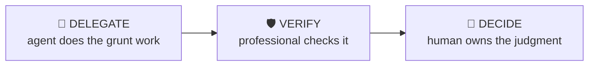

# Meeting Prep

> Walk into any client, management or interview meeting knowing the company, the people and the agenda cold.

The 30-minute briefing routine: company snapshot, recent events, the counterparty’s likely agenda, who’s in the room and what they care about, plus the questions you should ask and the ones you’ll be asked.

| | |
|---|---|
| **Output** | Meeting brief: company, people, agenda, questions |
| **Level** | All levels · Core |
| **Time** | ~30 min |
| **Context** | Interviews & on the job |

## The operating split

### Delegate — what the agent should do

- Compiling recent news, results and stock context
- Gathering public backgrounds on attendees
- Drafting the one-page brief in standard format

### Verify — agent output a professional must check

- News items are current and real — a fabricated "recent event" is fatal
- People data matches the right person (name collisions are common)

### Decide — judgment the human owns (never the agent)

The agent must NOT make these calls; surface evidence and frame them as open questions:

- Your objective for the meeting and the one thing you must leave with
- Which questions to actually ask given the room
- What NOT to bring up

## Inputs

- Company / counterparty and meeting purpose
- Attendee names if known
- Your role in the meeting (running it, supporting, interviewing)

## Workflow

1. **Refresh the company** — Latest results, stock move, news flow, anything announced this week — the thing you’ll be embarrassed not to know.
2. **Profile the people** — Backgrounds, tenure, past statements, what each attendee is likely to want from the meeting.
3. **Predict the agenda** — What do THEY want to cover? Prepare for their meeting, not just yours.
4. **Prepare your questions** — 3-5 questions that show preparation and move your objective forward.
5. **Anticipate theirs** — What will they ask you? Draft crisp answers to the hard ones.

## Example output

> **Illustrative output** — fictional subject, illustrative content.

A completed run returns **meeting brief: company, people, agenda, questions** as structured cards, each carrying a source
reference, followed by a verification block (3 checks: pass / needs-review /
unverified) and the sharpest follow-up questions. The agent covers the Delegate items —
compiling recent news, results and stock context; gathering public backgrounds on attendees — and explicitly leaves the Decide
items as open questions for the professional.

## Quality checklist (apply before returning output)

- Brief fits one page
- Every attendee has a line
- Your top-3 questions written verbatim

## Grounding rules

- Use only source material provided by the user or fetched from pages you cite.
- Every factual claim carries a source reference; numbers carry their period (Q/FY).
- Never invent figures, filings, dates or events; say "not provided" instead.

---

**Run this workflow interactively** — with source auto-fetch and practice drills — at
[l3vlup.com/skills/meeting-prep](https://www.l3vlup.com/skills/meeting-prep).

The machine-readable form of this workflow, in the Finance OS contract, is
[`workflow.json`](./workflow.json); the contract is described in
[docs/finance-skill-spec.md](../../../docs/finance-skill-spec.md).
