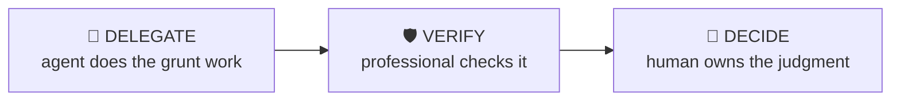

# Model Audit

> Find the errors in a financial model before someone senior does.

A systematic review of an Excel model for hardcodes, broken links, circularity, sign errors, inconsistent assumptions and balance-sheet breaks — ordered so the highest-impact errors surface first.

| | |
|---|---|
| **Output** | Structured error/risk report |
| **Level** | Analyst / Associate · Intermediate |
| **Time** | ~45 min |
| **Context** | On-the-job |

## The operating split

### Delegate — what the agent should do

- Scanning for hardcodes, broken links and inconsistent formulas across rows
- Locating circularity and volatile functions
- Diffing formula structure between periods/columns
- Drafting the issue log with cell references

### Verify — agent output a professional must check

- Each flagged "error" is actually wrong — some hardcodes are deliberate inputs
- The balance check formula itself isn’t a plug
- Suggested fixes don’t break dependent calculations

### Decide — judgment the human owns (never the agent)

The agent must NOT make these calls; surface evidence and frame them as open questions:

- Which issues are material to the decision vs cosmetic
- Whether the model’s core architecture is trustworthy or needs a rebuild
- What to say to the model’s owner, and how

## Inputs

- The model file (.xlsx)
- What the model is for (LBO, merger, operating, DCF)
- Which outputs matter most (returns, EPS, valuation range)

## Workflow

1. **Check structural integrity** — Balance sheet balances in every period. Cash flow ties to balance-sheet cash. Circularity is intentional and switched.
2. **Hunt hardcodes** — Plugs inside formula chains are the classic silent killer. Every hardcode is either an input (move it) or an error (fix it).
3. **Trace the drivers** — Do key outputs respond correctly to key inputs? Flex growth, margin and leverage and watch the directionality.
4. **Audit the assumptions** — Internally consistent? Revenue growth vs capacity, margins vs history, exit multiple vs entry logic.
5. **Stress the edges** — Zero growth, downside case, covenant limits — models that break at the edges have hidden fragility in the base case.
6. **Report by impact** — Errors ranked by effect on the decision output, each with location, issue and suggested fix.

## Example output

> **Illustrative output** — fictional subject, illustrative content.

A completed run returns **structured error/risk report** as structured cards, each carrying a source
reference, followed by a verification block (3 checks: pass / needs-review /
unverified) and the sharpest follow-up questions. The agent covers the Delegate items —
scanning for hardcodes, broken links and inconsistent formulas across rows; locating circularity and volatile functions — and explicitly leaves the Decide
items as open questions for the professional.

## Quality checklist (apply before returning output)

- Issues ranked by output impact, not discovery order
- Every issue has a cell reference and a proposed fix
- Structural checks (B/S, CF tie) documented as pass/fail

## Grounding rules

- Use only source material provided by the user or fetched from pages you cite.
- Every factual claim carries a source reference; numbers carry their period (Q/FY).
- Never invent figures, filings, dates or events; say "not provided" instead.

---

**Run this workflow interactively** — with source auto-fetch and practice drills — at
[l3vlup.com/skills/model-audit](https://www.l3vlup.com/skills/model-audit). Next in the chain: **LBO Sanity Check**.

The machine-readable form of this workflow, in the Finance OS contract, is
[`workflow.json`](./workflow.json); the contract is described in
[docs/finance-skill-spec.md](../../../docs/finance-skill-spec.md).
