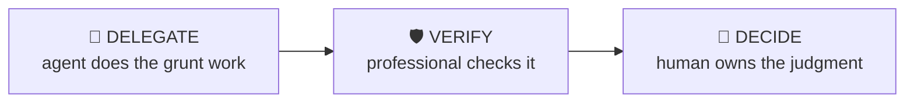

# Pitchbook QC

> Catch the errors in a pitchbook before it leaves the building.

The final-pass quality control every book needs: numbers consistent across pages, footnotes complete, formatting to house style, sources current, and the story coherent page to page. The checks that save analysts from 2am reprints.

| | |
|---|---|
| **Output** | QC issue list by page |
| **Level** | Analyst · Core |
| **Time** | ~20 min |
| **Context** | On-the-job |

## The operating split

### Delegate — what the agent should do

- Extracting every numeric instance for cross-page consistency checks
- Flagging missing/undated footnotes
- Checking formatting consistency against style rules

### Verify — agent output a professional must check

- Flagged inconsistencies are real (rounding conventions differ by page legitimately)
- Style "fixes" don’t break intentional exceptions

### Decide — judgment the human owns (never the agent)

The agent must NOT make these calls; surface evidence and frame them as open questions:

- Which issues block sending vs get fixed in the next turn
- Whether the storyline works — no tool judges that

## Inputs

- The deck (PDF or PPTX)
- House style rules if any
- Which pages carry the key numbers

## Workflow

1. **Cross-foot the numbers** — The same metric must match everywhere it appears. Valuation page vs summary vs football field.
2. **Check the footnotes** — Every chart sourced and dated. "Source: Company filings" with no date is not a source.
3. **Enforce the style** — Fonts, decimals, currency conventions, color palette, alignment — consistency reads as competence.
4. **Read for story** — Does each page earn its place and lead to the next? Orphan pages get cut or moved.
5. **Final mechanical pass** — Page numbers, TOC accuracy, no draft watermarks, client name correct EVERYWHERE (the classic).

## Example output

> **Illustrative output** — fictional subject, illustrative content.

A completed run returns **qc issue list by page** as structured cards, each carrying a source
reference, followed by a verification block (3 checks: pass / needs-review /
unverified) and the sharpest follow-up questions. The agent covers the Delegate items —
extracting every numeric instance for cross-page consistency checks; flagging missing/undated footnotes — and explicitly leaves the Decide
items as open questions for the professional.

## Quality checklist (apply before returning output)

- Zero cross-page numeric inconsistencies unexplained
- Every exhibit sourced and dated
- Client/company name search performed on the final file

## Grounding rules

- Use only source material provided by the user or fetched from pages you cite.
- Every factual claim carries a source reference; numbers carry their period (Q/FY).
- Never invent figures, filings, dates or events; say "not provided" instead.

---

**Run this workflow interactively** — with source auto-fetch and practice drills — at
[l3vlup.com/skills/pitchbook-qc](https://www.l3vlup.com/skills/pitchbook-qc). Next in the chain: **Company Profile**.

The machine-readable form of this workflow, in the Finance OS contract, is
[`workflow.json`](./workflow.json); the contract is described in
[docs/finance-skill-spec.md](../../../docs/finance-skill-spec.md).
