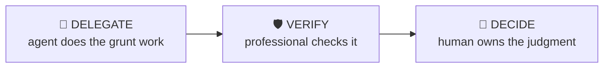

# Diligence Question Builder

> Build a prioritised diligence list that attacks the thesis, not a generic checklist.

Generate and rank diligence questions from the investment thesis: for each pillar and each key risk, what evidence would confirm or kill it, who has that evidence, and what to ask first when management time is scarce.

| | |
|---|---|
| **Output** | Prioritised diligence question list by workstream |
| **Level** | Associate · Intermediate |
| **Time** | ~25 min |
| **Context** | On-the-job |

## The operating split

### Delegate — what the agent should do

- Generating candidate questions per workstream from the thesis
- Grouping and deduplicating into a tracker format
- Drafting data-request lists in standard form

### Verify — agent output a professional must check

- Questions are answerable from the named source
- No question already answered in materials you hold — that costs credibility

### Decide — judgment the human owns (never the agent)

The agent must NOT make these calls; surface evidence and frame them as open questions:

- Which three questions matter most — the kill-power ranking
- What you’re willing to take on trust vs must verify
- When you have enough to advance vs walk

## Inputs

- Thesis pillars and key risks (or the teaser/CIM)
- Process stage and access level (management meeting, data room, expert calls)

## Workflow

1. **Map thesis to evidence** — For each pillar: what would have to be true, and what data proves it?
2. **Map risks to tests** — For each risk: what’s the cheapest fastest way to size it?
3. **Rank by kill-power** — Questions that could kill the deal go first — you want bad news early and cheap.
4. **Route by source** — Management vs data room vs experts vs desktop. Don’t burn a management meeting on data-room questions.
5. **Draft the asks** — Specific, answerable questions — "walk me through churn by cohort for FY24-26", not "tell us about retention".

## Example output

> **Illustrative output** — fictional subject, illustrative content.

A completed run returns **prioritised diligence question list by workstream** as structured cards, each carrying a source
reference, followed by a verification block (3 checks: pass / needs-review /
unverified) and the sharpest follow-up questions. The agent covers the Delegate items —
generating candidate questions per workstream from the thesis; grouping and deduplicating into a tracker format — and explicitly leaves the Decide
items as open questions for the professional.

## Quality checklist (apply before returning output)

- Every thesis pillar has at least one confirming and one killing test
- Top-5 list fits a 45-minute management meeting
- Each question names its source and owner

## Grounding rules

- Use only source material provided by the user or fetched from pages you cite.
- Every factual claim carries a source reference; numbers carry their period (Q/FY).
- Never invent figures, filings, dates or events; say "not provided" instead.

---

**Run this workflow interactively** — with source auto-fetch and practice drills — at
[l3vlup.com/skills/diligence-question-builder](https://www.l3vlup.com/skills/diligence-question-builder). Next in the chain: **IC Memo Builder**.

The machine-readable form of this workflow, in the Finance OS contract, is
[`workflow.json`](./workflow.json); the contract is described in
[docs/finance-skill-spec.md](../../../docs/finance-skill-spec.md).
