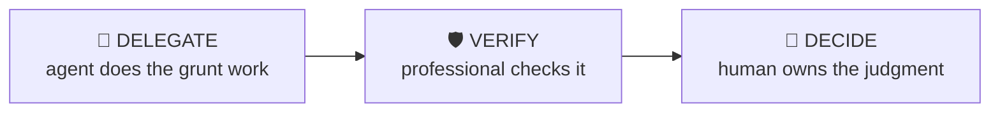

# IC Memo Builder

> Draft a first-pass investment committee memo that anticipates the committee’s questions.

Structure a PE investment committee memo: deal summary, investment thesis, market, financials, returns, risks and diligence status — organised around the decisions the IC needs to make, not around everything you know.

| | |
|---|---|
| **Output** | IC memo skeleton with drafted sections |
| **Level** | Associate · Advanced |
| **Time** | ~60 min |
| **Context** | On-the-job |

## The operating split

### Delegate — what the agent should do

- Assembling section drafts from your model, CIM notes and diligence materials
- Formatting the returns and sensitivity exhibits
- Compiling the diligence tracker table

### Verify — agent output a professional must check

- Numbers in prose match the model exhibits exactly
- Claimed market data traces to a named source
- Thesis pillars and risk section don’t silently contradict each other

### Decide — judgment the human owns (never the agent)

The agent must NOT make these calls; surface evidence and frame them as open questions:

- The recommendation and conviction level
- Which risks are deal-breakers vs priced-in
- What you’re asking the IC for: approval, guidance or more time

## Inputs

- Deal basics: target, sector, deal type, stage in process
- Your model outputs (returns, leverage, sensitivities)
- Diligence findings so far

## Workflow

1. **Lead with the decision** — What is the IC being asked to approve, at what valuation, by when? First half-page.
2. **Structure the thesis** — 2-4 pillars, each with evidence and the diligence item that would confirm or kill it.
3. **Present returns honestly** — Base/downside/upside with drivers, not just the base MOIC. Show what breaks the deal.
4. **Pre-empt the questions** — Every IC has predictable attacks: customer concentration, cyclicality, management, exit. Answer them before they’re asked.
5. **Flag the unknowns** — Open diligence items with owners and dates. Hiding unknowns is how memos lose credibility.

## Example output

> **Illustrative output** — fictional subject, illustrative content.

A completed run returns **ic memo skeleton with drafted sections** as structured cards, each carrying a source
reference, followed by a verification block (3 checks: pass / needs-review /
unverified) and the sharpest follow-up questions. The agent covers the Delegate items —
assembling section drafts from your model, cim notes and diligence materials; formatting the returns and sensitivity exhibits — and explicitly leaves the Decide
items as open questions for the professional.

## Quality checklist (apply before returning output)

- The ask is explicit on page one
- Each thesis pillar maps to a diligence item
- Downside case is a real scenario, not base-minus-10%

## Grounding rules

- Use only source material provided by the user or fetched from pages you cite.
- Every factual claim carries a source reference; numbers carry their period (Q/FY).
- Never invent figures, filings, dates or events; say "not provided" instead.

---

**Run this workflow interactively** — with source auto-fetch and practice drills — at
[l3vlup.com/skills/ic-memo-builder](https://www.l3vlup.com/skills/ic-memo-builder). Next in the chain: **Diligence Question Builder**.

The machine-readable form of this workflow, in the Finance OS contract, is
[`workflow.json`](./workflow.json); the contract is described in
[docs/finance-skill-spec.md](../../../docs/finance-skill-spec.md).
