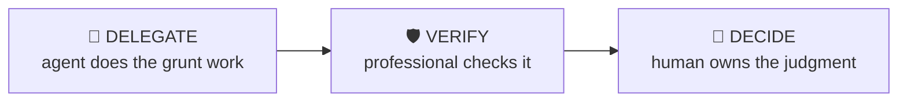

# LBO Sanity Check

> Review an LBO’s returns drivers and catch the assumptions doing the heavy lifting.

Decompose an LBO’s returns into leverage, EBITDA growth, margin change and multiple expansion — then interrogate whichever driver carries the deal. The fastest way to look sharp in a PE seat or interview.

| | |
|---|---|
| **Output** | Returns-driver decomposition + challenge list |
| **Level** | Analyst / Associate · Intermediate |
| **Time** | ~20 min |
| **Context** | Interviews & on the job |

## The operating split

### Delegate — what the agent should do

- Computing the returns attribution bridge from the model
- Building the sensitivity grid (exit multiple × growth)
- Pulling comparable-deal entry multiples where public

### Verify — agent output a professional must check

- The bridge actually reconciles to the model’s MOIC/IRR
- Debt paydown in the bridge matches the model’s FCF sweep
- Sensitivities flex the right cells (no dead inputs)

### Decide — judgment the human owns (never the agent)

The agent must NOT make these calls; surface evidence and frame them as open questions:

- Whether the load-bearing assumption is believable
- What downside case is the honest one for THIS business
- Deal-breaker vs negotiating point vs acceptable risk

## Inputs

- LBO model or headline assumptions (entry/exit multiple, leverage, growth, margins, hold)
- Context: live deal review, screening or interview case

## Workflow

1. **Decompose returns** — Bridge from entry equity to exit equity: deleveraging, EBITDA growth, margin change, multiple change. Attribute the MOIC.
2. **Name the load-bearing driver** — Every LBO has one assumption doing most of the work. Find it.
3. **Benchmark the assumptions** — Entry vs comparable deals, growth vs company history, exit multiple vs entry (expansion needs a story).
4. **Test the downside** — Flat EBITDA, exit at entry multiple, one turn less leverage — does the deal still clear the hurdle?
5. **Write the challenges** — The 3-5 questions the IC will ask, with the numbers that answer them.

## Example output

> **Illustrative output** — fictional deal, illustrative numbers.

**PROJECT MERIDIAN — RETURNS DRIVER CHECK** *(Private Equity lens)*

**MOIC bridge (5-yr hold, entry 9.0x / exit 9.0x, 5.0x leverage):** Entry equity 400 → exit equity 1,310 = **3.3x MOIC (~27% IRR)**. Attribution: debt paydown +38%, EBITDA growth +62%, multiple 0%.

**The load-bearing assumption:** 11% EBITDA CAGR vs 6% historical (FY22-25 per CIM). The deal IS the growth case — nothing else carries it.

**Downside test:** flat EBITDA + exit at entry = 1.6x / ~10% IRR — below hurdle. **Challenge list for IC:** evidence for the growth step-up beyond management plan? · aftermarket pricing power supported by churn data? · what does the 100-day plan actually add vs momentum?

**Verification:** bridge reconciles to model MOIC ✓ · sweep matches FCF ✓ · sensitivity grid flexes live cells ✓.

## Quality checklist (apply before returning output)

- MOIC attribution sums to total MOIC
- Every challenged assumption has a benchmark
- Downside case is stated with its return, not just direction

## Grounding rules

- Use only source material provided by the user or fetched from pages you cite.
- Every factual claim carries a source reference; numbers carry their period (Q/FY).
- Never invent figures, filings, dates or events; say "not provided" instead.

---

**Run this workflow interactively** — with source auto-fetch and practice drills — at
[l3vlup.com/skills/lbo-sanity-check](https://www.l3vlup.com/skills/lbo-sanity-check). Next in the chain: **IC Memo Builder**.

The machine-readable form of this workflow, in the Finance OS contract, is
[`workflow.json`](./workflow.json); the contract is described in
[docs/finance-skill-spec.md](../../../docs/finance-skill-spec.md).
